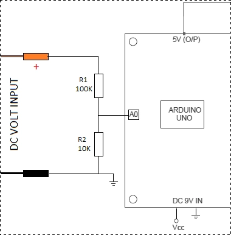

# MABC-ESP
 Main Body Controller with ESP32 AZ-Delevery Chip
 ToolDroid Maincontroller
 

# ----Mp3 player Comand---
*  myDFPlayer.next();  //Play next mp3
*  myDFPlayer.previous();  //Play previous mp3
*  myDFPlayer.play(1);  //Play the first mp3
*  myDFPlayer.loop(1);  //Loop the first mp3
*  myDFPlayer.pause();  //pause the mp3
*  myDFPlayer.start();  //start the mp3 from the pause
*  myDFPlayer.playFolder(15, 4);  //play specific mp3 in SD:/15/004.mp3; Folder Name(1~99); File Name(1~255)
*  myDFPlayer.enableLoopAll(); //loop all mp3 files.
*  myDFPlayer.disableLoopAll(); //stop loop all mp3 files.
*  myDFPlayer.playMp3Folder(4); //play specific mp3 in SD:/MP3/0004.mp3; File Name(0~65535)
*  myDFPlayer.advertise(3); //advertise specific mp3 in SD:/ADVERT/0003.mp3; File Name(0~65535)
*  myDFPlayer.stopAdvertise(); //stop advertise
*  myDFPlayer.playLargeFolder(2, 999); //play specific mp3 in SD:/02/004.mp3; Folder Name(1~10); File Name(1~1000)
*  myDFPlayer.loopFolder(5); //loop all mp3 files in folder SD:/05.
*  myDFPlayer.randomAll(); //Random play all the mp3.
*  myDFPlayer.enableLoop(); //enable loop.
*  myDFPlayer.disableLoop(); //disable loop.

# For Volt Reading on Batt sens
make a voltage divider with R1 100K  R2 10K  and on R2 a 10K Poti for finetuning

# Config Command for EEPROM
* OTA-ON / OTA-OFF | Activate OTA Update via Browser and deactivate R2Touch App WLAN
* IR-ON / IR-OFF | Activate range Sensor
* DM-0 - DM -3 | Set Default Mode on Start
* FUEL-ON / FUEL-OFF | Activate Fuelsensor Main Power
* DISP-ON / DISP-OFF  | Switch small Display
*  
